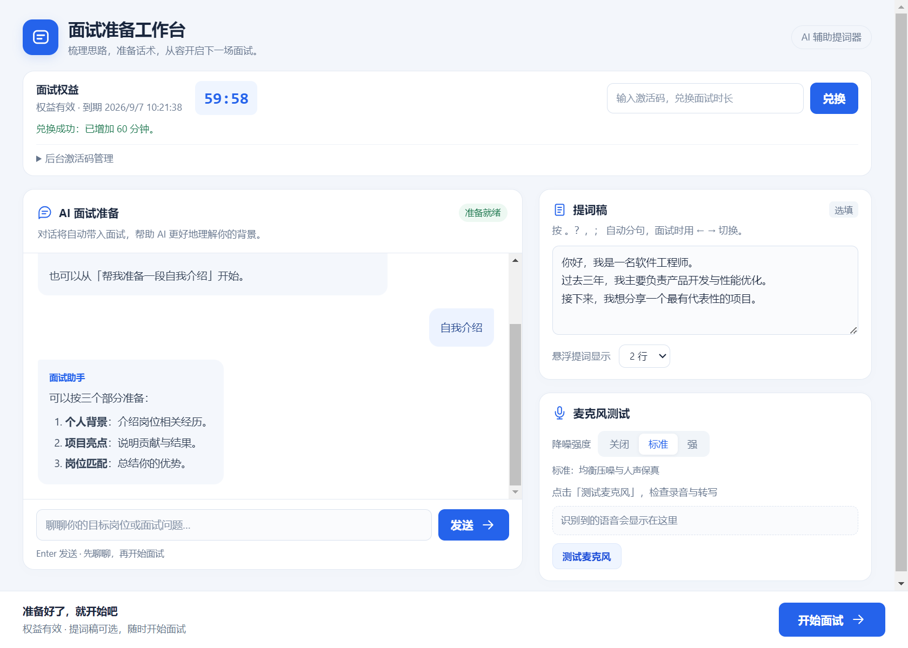
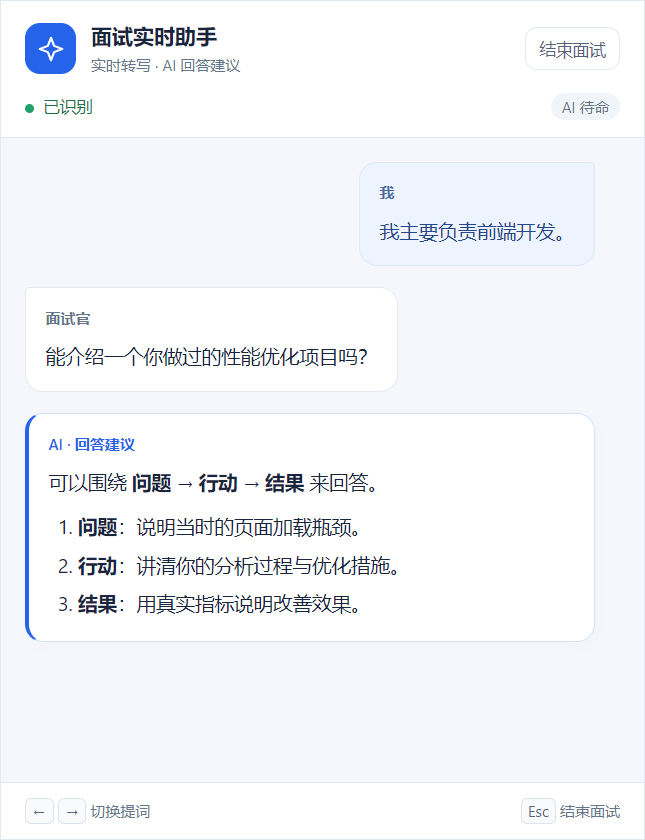

# AnswerPlayer

**让每一次表达都有准备。**

AnswerPlayer 是一款基于 Electron 的 AI 面试辅助桌面应用，将面试前准备、实时语音转写、AI 回答建议与独立悬浮提词整合在一起，帮助你梳理思路、组织语言，更清晰地展示自己的经历和能力。

从准备一段自我介绍，到围绕项目经历展开讨论，再到面试中的提词与建议，你可以在同一套工作流中完成。

## 界面预览

### 面试准备工作台

浅色双栏布局，左侧与 AI 交流，右侧编辑提词稿、测试麦克风。底部常驻“开始面试”入口，小窗口自动切换为单栏。



### 面试实时助手

独立置顶聊天窗区分面试官、本人和 AI 建议，分别显示音频连接状态与 AI 生成状态。阅读历史消息时暂停自动跟随，可一键回到最新消息。



> 截图使用模拟对话和模拟权益数据，用于展示界面效果。

## 当前功能

| 功能 | 说明 |
| --- | --- |
| AI 面试准备 | 讨论目标岗位、自我介绍与项目经历；当前准备对话会带入面试上下文。 |
| 实时语音转写 | 分别采集麦克风和系统音频，通过讯飞服务呈现临时识别与最终结果。 |
| 对话角色区分 | 根据音频来源区分本人和面试官，并对部分重复转写进行去重。 |
| AI 回答建议 | 根据面试问题、准备对话和提词稿生成流式建议，支持常见 Markdown 内容展示。 |
| 独立悬浮提词 | 稿件按中文标点分句，支持一行或两行显示，通过方向键切换。 |
| 麦克风测试 | 面试前检查录音与转写，提供关闭、标准和强三档降噪设置。 |
| 阅读位置保留 | 向上阅读聊天记录时保持当前位置，通过“回到最新消息”恢复跟随。 |
| 激活码权益 | 支持时长兑换、到期倒计时，以及管理员批量生成、查看、启用和停用激活码。 |

## 快速开始

### 1. 准备环境

- 安装 Node.js 与 npm。
- 当前开发和界面验证环境为 Windows；其他平台的系统音频采集与透明窗口效果需要单独验证。
- 准备讯飞语音识别服务和 DeepSeek API 凭据。真实转写与 AI 对话需要网络连接和可用服务额度。

在项目目录中安装依赖：

```bash
npm install
```

### 2. 配置服务

应用从环境变量读取第三方服务凭据。`.env.example` 仅列出变量名；应用不会自动读取 `.env` 文件，也不要把真实密钥写入源码或提交到仓库。

PowerShell 示例：

```powershell
$env:XUNFEI_APPID = "your_xunfei_app_id"
$env:XUNFEI_API_KEY = "your_xunfei_api_key"
$env:XUNFEI_API_SECRET = "your_xunfei_api_secret"
$env:DEEPSEEK_API_KEY = "your_deepseek_api_key"
$env:DEEPSEEK_BASE_URL = "https://api.deepseek.com"
```

### 3. 启动应用

```bash
npm start
```

应用默认打开 1120 × 800 的准备工作台。开始面试前，需要先兑换有效激活码。

### 4. 本地开发时生成激活码

当前激活码管理在 Electron 主进程中运行。开发者可先在 PowerShell 中设置管理密钥，再启动应用：

```powershell
$env:ACTIVATION_ADMIN_SECRET = "replace-with-your-own-long-random-secret"
npm start
```

在首页展开“后台激活码管理”，输入相同密钥，选择商品与数量后生成激活码，再将生成的激活码用于兑换。明文激活码仅在生成后展示，请及时保存。

权益按绝对到期时间连续计时，关闭应用也不会暂停。当前开发版数据保存在 Electron 用户数据目录下的 `activation-store.json` 中，不是独立部署的远程授权服务。

> 本仓库只公开桌面客户端。生产环境的授权服务、部署配置和运维资料不包含在仓库中，也不接受与私有服务端实现相关的 Issue。

## 使用流程

### 面试前：整理背景与回答要点

1. 与 AI 讨论目标岗位、个人经历或待练习的问题，例如“帮我梳理一个前端性能优化项目的回答结构”。
2. 将准备好的自我介绍或项目要点粘贴到提词稿中；提词稿为选填项。
3. 选择悬浮提词显示行数，默认两行。
4. 测试麦克风，根据环境选择降噪强度，默认标准档。
5. 确认权益有效后，点击“开始面试”。

### 面试中：查看转写、建议与提词

- **聊天窗**：显示实时转写和 AI 建议，标题栏可拖动，窗口可调整大小。
- **字幕窗**：独立显示提词内容，便于单独调整位置。
- **自动建议**：面试官最终转写后，约 1.5 秒的等待计时会触发建议；新的语音事件会影响计时。已有回答生成时，新触发会等待当前生成结束。
- **阅读历史**：向上滚动后暂停自动跟随，点击“回到最新消息”恢复。
- **状态反馈**：查看音频连接、识别中、连接错误与 AI 生成状态。

### 快捷键

在面试窗口获得焦点时使用：

| 按键 | 操作 |
| --- | --- |
| `←` | 切换到上一条提词 |
| `→` | 切换到下一条提词 |
| `Esc` | 结束面试并返回准备首页 |

准备首页中，`Enter` 发送 AI 消息；中文输入法选词期间不会误发送。

## 技术实现

| 层级 | 技术 |
| --- | --- |
| 桌面运行时 | Electron 33 |
| 界面 | 原生 HTML、CSS、JavaScript |
| 进程通信 | Electron IPC、preload 桥接 |
| 语音识别 | 讯飞实时语音识别、WebSocket |
| AI 建议 | DeepSeek Chat Completions 接口、流式输出 |
| 音频处理 | Web Audio API、AudioWorklet、PCM 重采样 |
| 本地权益 | 主进程管理、本地 JSON 存储、客户端倒计时 |

麦克风与系统音频分别处理和发送；AI 建议结合当前对话、准备记录及提词稿生成。

## 项目结构

```text
AnswerPlayer/
├── main.js                    # 主进程：窗口、语音、AI、权益与 IPC
├── index.html                 # 面试准备工作台
├── prompter.html              # 面试聊天窗与音频采集
├── subtitle.html              # 独立透明提词窗
├── preload.js                 # 准备页桥接
├── preload-prompter.js         # 面试聊天窗桥接
├── preload-subtitle.js         # 提词窗桥接
├── audio-worklet.js            # PCM 音频重采样
├── tests/                     # 隔离的 Electron 界面测试
├── artifacts/                 # 界面截图（测试日志与结果不提交）
├── .env.example               # 环境变量名示例（不含密钥）
├── CONTRIBUTING.md            # 社区贡献指南
└── package.json
```

## 界面验证

安装依赖后，可在项目目录运行：

```bash
npm test
```

测试使用独立临时配置与隐藏的 Electron 窗口，不加载业务主进程，也不调用真实付费服务。截图、日志或验证结果输出到 `artifacts/` 下对应目录。

- **准备首页**：覆盖窗口适配、输入法、流式回复、权益兑换与到期、麦克风状态及启动参数。
- **面试聊天页**：覆盖角色标签、转写去重、自动触发、长内容、滚动跟随、音频异常和快捷键消息。

当前两组测试分别通过 20 项和 12 项检查。这些结果验证模拟事件下的界面与交互，不代表真实麦克风、系统音频或在线服务已通过端到端测试。

## 功能路线图

以下为规划方向，尚未实现：

- [ ] **简历与岗位解析**：导入简历及职位描述，提取经历亮点和岗位关注点。
- [ ] **个人知识库**：管理项目资料、常用话术与准备笔记，按需引用回答素材。
- [ ] **模拟面试**：围绕目标岗位连续提问，提供练习反馈。
- [ ] **面试复盘**：整理问题清单、回答摘要和改进建议，支持报告导出。
- [ ] **多模型切换**：在界面中配置和选择不同的模型服务。
- [ ] **历史会话管理**：保存、检索和恢复不同场次的准备与面试记录。
- [ ] **远程授权服务**：将激活码与权益校验迁移至独立后端。

## 参与贡献

欢迎提交问题、改进文档和贡献代码。开始开发前请阅读 [CONTRIBUTING.md](CONTRIBUTING.md)。提交 Pull Request 前请运行 `npm test`，并确认没有包含密钥、个人数据、服务端代码或部署配置。

本项目采用 [MIT License](LICENSE) 开源许可证。

## 使用说明与边界

- 提词稿按 `。`、`？`、`，`、`；` 分句，保留句尾标点。
- 音频来源用于辅助角色区分，可能受回声、串音和设备设置影响。
- 语音数据会发送给配置的语音识别服务；准备对话、提词稿和面试上下文会用于 AI 请求。本项目不是完全离线应用。
- AI 内容供组织思路时参考，请结合自己的真实经历核对；录音与辅助工具的使用应符合参与者约定和面试规则。
- 当前未配置安装包构建脚本，主要通过源码启动；透明窗口、音频权限和系统音频可用性取决于运行环境。

---

**AnswerPlayer · 把准备转化为更清晰、更有条理的表达。**
